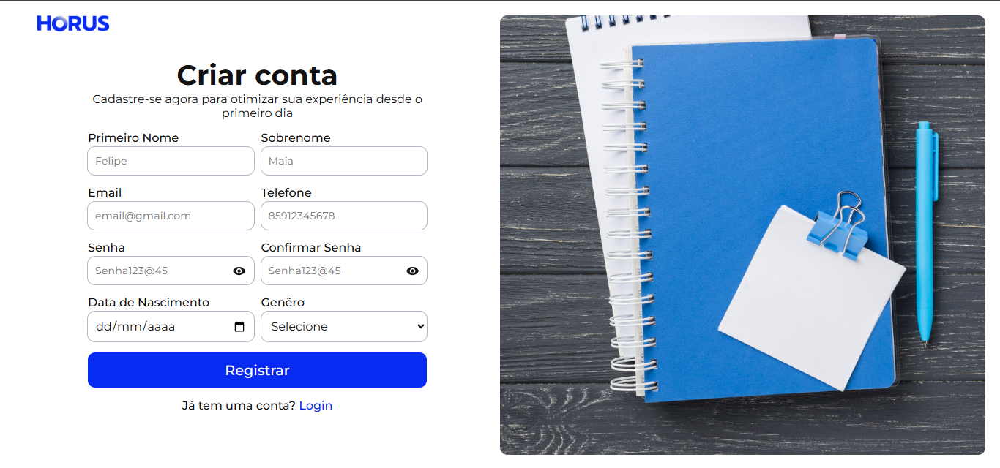
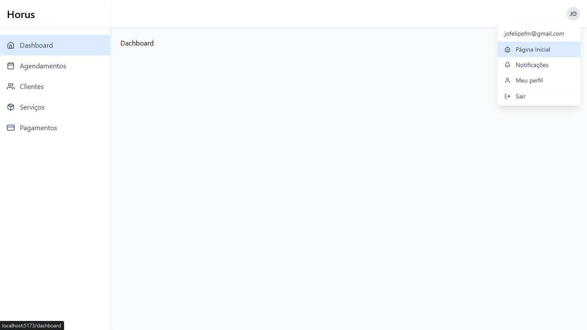

# 🦉 Horus

**Horus** é uma plataforma completa de agendamentos e gestão de atendimentos para profissionais liberais e autônomos. Com ele, você elimina a bagunça da agenda manual, evita faltas por esquecimento e oferece uma experiência moderna e profissional para seus clientes.

---

## 💡 O que é o Horus?

Horus é um sistema web completo que permite que profissionais de diversas áreas gerenciem seus atendimentos com facilidade. Ele oferece agendamento online, pagamentos automatizados, lembretes inteligentes, reprogramações práticas e muito mais — tudo em um só lugar.

---

## 🎯 Para quem é o Horus?

Horus foi pensado especialmente para profissionais que atendem por hora ou sessão, como:

* Psicólogos
* Terapeutas
* Personal Trainers
* Esteticistas
* Nutricionistas
* Fisioterapeutas
* Consultores

Se você vive de agenda, Horus é pra você.

---

## 🛠️ O que o Horus resolve?

* Reduz **faltas e atrasos** com lembretes automáticos por WhatsApp, SMS e e-mail
* Evita **conflitos de horário** com um sistema inteligente de agendamento
* Elimina a **confirmação manual** de cada cliente
* Garante **pagamentos antecipados ou recorrentes**
* Oferece **flexibilidade** para reagendamentos e cancelamentos com regras personalizadas
* Melhora a **experiência do cliente**, que pode agendar e pagar com poucos cliques

---

## ⚙️ Como funciona?

1. **Perfil Profissional**
   O profissional cria sua conta, configura os serviços que oferece, seus horários disponíveis e regras de funcionamento (como tempo de antecedência mínima, políticas de cancelamento e formas de pagamento).

2. **Página de Agendamento Personalizada**
   Uma página única e customizada é gerada, onde os clientes podem visualizar horários disponíveis, agendar sessões e realizar pagamentos.

3. **Notificações Inteligentes**
   Clientes e profissionais recebem notificações automáticas sobre confirmações, lembretes, alterações ou cancelamentos.

4. **Dashboard Administrativo**
   O profissional acompanha agendamentos, pagamentos, estatísticas, e pode gerenciar clientes com facilidade.

5. **Pagamentos Online**
   Horus integra com gateways de pagamento para permitir cobrança via Pix, cartão de crédito e boleto.

6. **Reagendamentos Automatizados**
   Em caso de imprevistos, tanto o cliente quanto o profissional podem alterar o horário com base nas regras configuradas, sem a necessidade de troca de mensagens.

---

## 🖼️ Imagens do Projeto
Confira uma prévia do HORUS:

